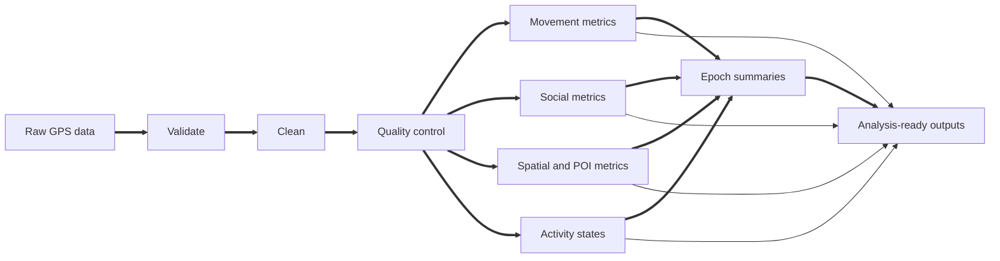
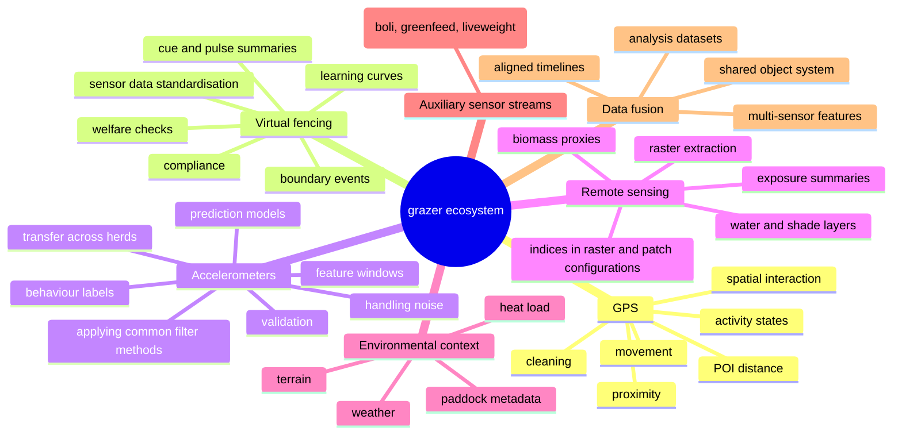
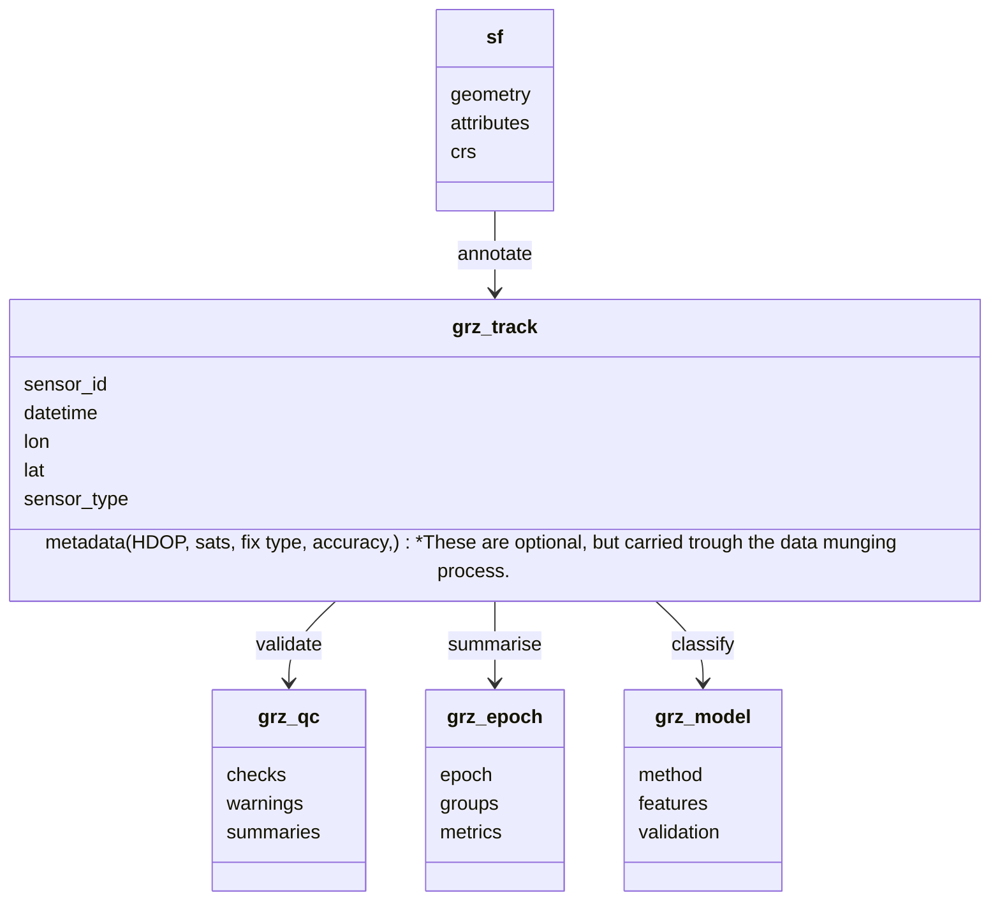
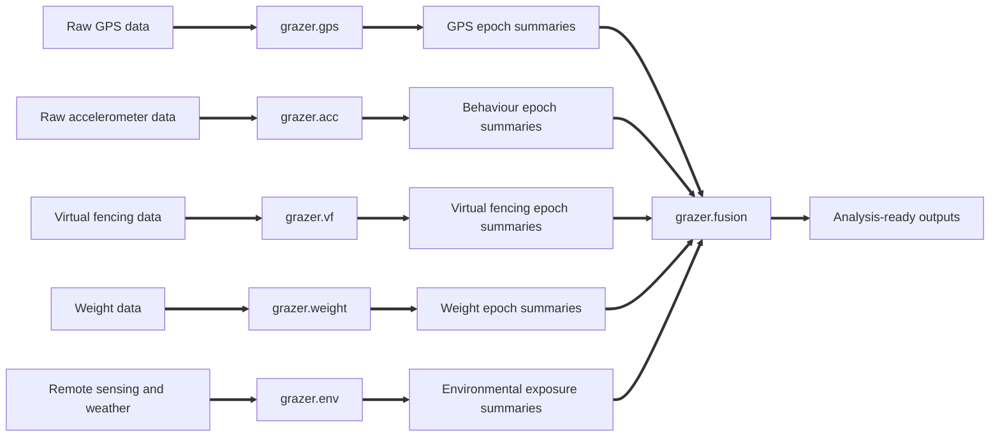
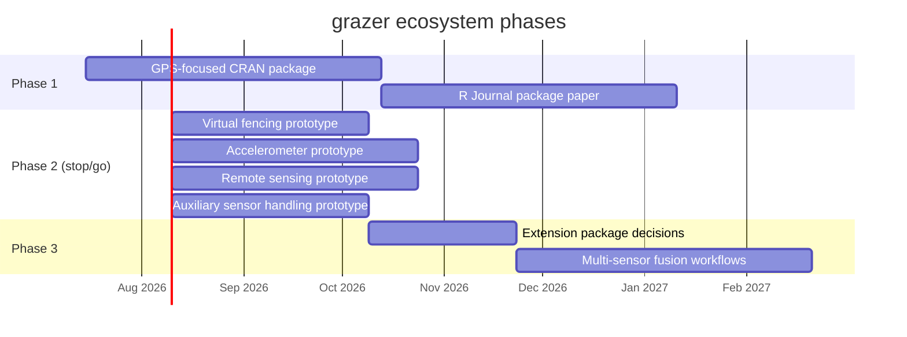

# grazer ecosystem roadmap

This document sketches the possible shape of the `grazer` ecosystem for collaborators. The aim is to build a coherent, reusable set of tools for precision livestock research in extensive grazing systems, starting with GPS workflows and expanding into other sensor streams and analysis modules.

The long-term ambition is that this becomes a go-to R ecosystem for researchers working with livestock sensor data, built around a small, deliberate object system, consistent naming, interoperable workflows, and practical modules for common research questions.

## Phase 1: GPS-focused CRAN package

Phase 1 will focus on getting `grazer` onto CRAN as a strong GPS workflow package.

The first release, as a minimum, should cover:

- GPS data validation and schema checks.
- Cleaning and quality control.
- Movement metrics.
- Basic social/proximity metrics.
- Spatial summaries.
- Distance to points of interest such as water, shade, supplements, fences, or infrastructure.
- Home-range and spatial-use summaries.
- Activity-state classification from GPS movement features.
- Epoch Summaries
- Visualisation and map-based exploration.
- A compact example dataset and vignettes that show a complete workflow.

This gives the project a clear first identity: `grazer` is the practical package for GPS-based livestock grazing workflows.

## Ecosystem vision

The broader ecosystem should be organised around research workflows, not only sensor hardware. Sensors are the inputs, but researchers usually care about questions such as:

- Where did animals spend time?
- How far did they move?
- How did they respond to boundaries, water, shade, pasture, heat, or management?
- What behaviours were they performing?
- How reliable were the sensors?
- How can collar event streams and other animal-linked sensor streams be standardised?
- How can multiple sensor streams be combined into analysis-ready data?

## Possible modules

| Area | What it covers | Example outputs |
|---|---|---|
| GPS core | Validation, cleaning, movement, proximity, POI distance, spatial interaction, activity states, epoch summaries, maps | Clean tracks, speed, distance, turning, paddock use, proximity metrics, activity-state summaries |
| Virtual fencing | Response to virtual boundaries and collar event streams, including standardisation of raw vendor outputs | Cue counts, pulse counts, boundary approaches, compliance, learning curves, welfare summaries |
| Accelerometers | Cleaning noisy signals, applying common filter methods, extracting windows, and building behaviour prediction workflows | Filtered signals, feature tables, behaviour labels, prediction outputs, validation summaries |
| Remote sensing | Linking animals to raster- and patch-based landscape products and management layers | Vegetation index exposure, biomass proxies, water/shade availability, patch-use summaries |
| Environmental context | Weather, heat load, terrain, and paddock metadata linked to animals or epochs | Heat exposure summaries, rainfall windows, terrain-linked movement summaries, paddock context tables |
| Auxiliary sensor streams | Animal-linked temporal streams in written/tabular formats such as bolus data, GreenFeed data, liveweight, or similar non-image, non-audio sensor outputs | Time-aligned methane, rumen temperature, intake, visit events, liveweight changes, derived temporal summaries |
| Sensor QC | Data quality across devices and deployments | Missing fixes, irregular intervals, dropout diagnostics, stream completeness summaries |
| Multi-sensor fusion | Joining GPS, virtual fence, accelerometer, auxiliary sensor, environment, and remote-sensing products | Aligned timelines, modelling tables, reproducible analysis datasets, fused feature sets |

## Shared object system

Returning information in R data frames reduces the barrier for researchers who already work in tidyverse, data.table, or base R workflows. The intent should be to keep the object system as small as possible. Where a good class already exists, it should be used directly rather than wrapped in a new grazer-specific class. In particular, spatial layers should use `sf` directly rather than introducing a separate spatial object.

Core object concepts:

- `grz_track`: row-level animal/sensor observations (gps,acc, methane, liveweight, etc.).
- `grz_epoch`: summarised data by time window.
- `grz_qc`: validation and sensor-quality summaries.
- `grz_model`: fitted classification or prediction objects (if built into grazer).

It's not clear at this stage how important it will be to define the `grz_epoch`, and `grz_qc` as standalone defined schemas; however, having a defined `grz_track` object should simplify data fusion modules in future.

Notes on object scope:
- Do not invent the wheel, if it's already simple in base R, or tidyverse, there is no need for additional schemas
- Spatial layers such as paddocks, POIs, fences, water, and shade should use `sf`.
- Auxiliary sensor streams such as bolus, GreenFeed, or liveweight should usually still fit within `grz_track`, with a clear schema for `sensor_type`, timestamps, animal linkage, and measured variables. However, there is a potential that movement and behaviour data are separated from other temporal sensor data.

## Package structure options

There are two ways the ecosystem could develop. At this stage, it's not clear what the best option it. And, there is potential that this changes as the function suite becomes more complex/sophisticated

### Option 1: One package to rule them all.

Everything stays inside `grazer`.

Advantages:

- Easier for users to install and learn at the start.
- One documentation site and one public package identity.
- Less coordination across packages and fewer dependency decisions for users.
- A simpler development path while the scope is still settling.

Risks:

- Heavy dependencies from remote sensing, modelling, accelerometer workflows, or specialised stream-processing tools could make installation and maintenance harder. Although, in theory, this can be tested by dev team.
- The package may become conceptually crowded as more specialist workflows are added.
- GPS, accelerometer, virtual fencing, remote sensing, weight, weather, and metadata streams may need distinct release cycles and different levels of maintenance attention.

### Option 2: Multiple smaller packages plus an aggregation package

If the workflows become sufficiently distinct, the ecosystem could move towards multiple smaller specialist packages with an aggregation package sitting above them.

In that model:

- stream-specific packages would handle specialist workflows such as GPS, accelerometers, virtual fencing, liveweight, or environmental data
- the aggregation package would not need to contain all workflow logic itself
- interoperability would occur mainly through standardised epoch summaries and analysis-ready tables

One possible shape could look like this:

Preferred strategy:

Start with one practical package, `grazer`, focused on the GPS and movement workflow for extensively grazed livestock. Only move towards multiple smaller packages plus an aggregation package if there is a clear maintenance, dependency, or user-group reason to do so.

Maintain detailed documentation and vignette's can ensure the applications of the package are clear.

## Naming convention

The naming should be continuous and predictable across the ecosystem.

### Package names

- Use `grazer` for the CRAN GPS package.
- If the ecosystem later grows into multiple packages, keep the `grazer.*` family rather than introducing a second naming system.
- Do not rename the package family away from `grazer`.

### Function names

Keep the current `grz_` prefix.

Recommended naming pattern:

- Use `grz_<stream>_<verb>()` where the stream comes before the action.
- This makes related functions easier to discover through autocomplete. For example, typing `grz_vf_` should surface the virtual fencing workflow.
- Use shared verbs across streams where possible, such as `read`, `standardise`, `validate`, `clean`, `align`, `annotate`, `calculate`, `summarise`, `classify`, `tune`, and `plot`.

Example names across major workflows:

| Workflow | Example names |
|---|---|
| GPS | `grz_gps_read_csv()`, `grz_gps_standardise()`, `grz_gps_validate()`, `grz_gps_clean()`, `grz_gps_align()`, `grz_gps_calculate_movement()`, `grz_gps_summarise_epoch()`, `grz_gps_plot_map()` |
| Accelerometer | `grz_acc_read_csv()`, `grz_acc_standardise()`, `grz_acc_validate()`, `grz_acc_clean()`, `grz_acc_align()`, `grz_acc_calculate_features()`, `grz_acc_classify_behaviour()`, `grz_acc_plot_features()` |
| Virtual fencing | `grz_vf_read_events()`, `grz_vf_standardise()`, `grz_vf_validate()`, `grz_vf_clean()`, `grz_vf_align()`, `grz_vf_calculate_events()`, `grz_vf_summarise_epochs()`, `grz_vf_classify_response()`, `grz_vf_plot_events()` |

This naming convention results in long function names which might not be a preferred method. Alternatively, the `grz_` prefix could be dropped in favour of the `sensor_verb` naming style.

## Phasing

## Preferred direction

1. Get `grazer` onto CRAN as a polished GPS package.
2. Use phase 1 to establish the shared schema, naming style, and pipe-friendly workflow, with a view to expanding.
3. Treat virtual fencing, accelerometers, remote sensing, auxiliary sensor streams, and fusion as future modules.
5. Keep the package structure under review, and only move to multiple smaller packages if the ecosystem genuinely needs it.