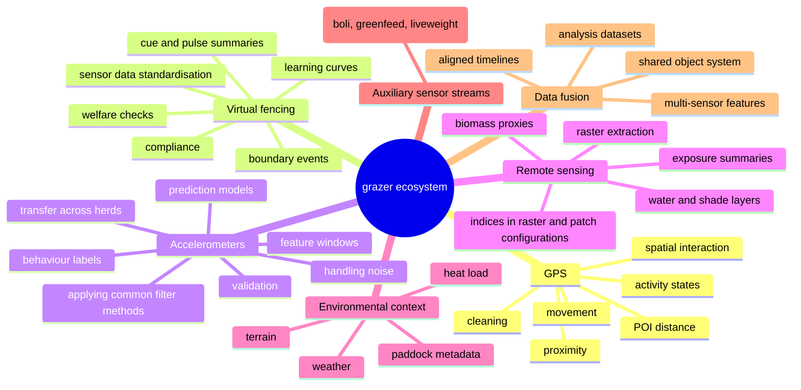
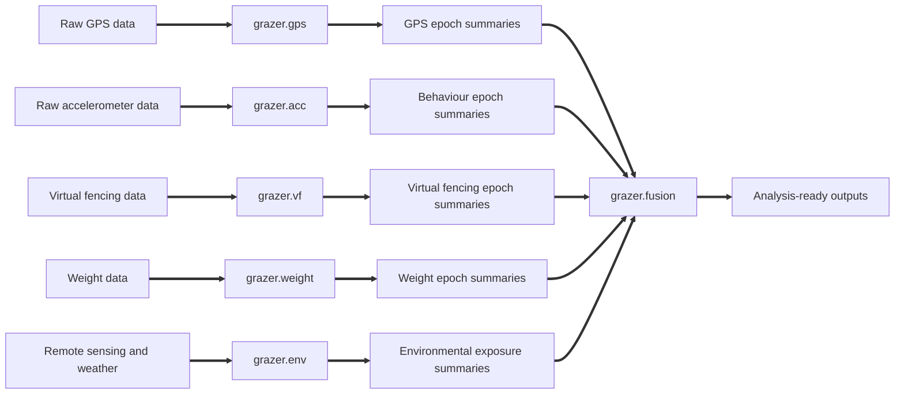
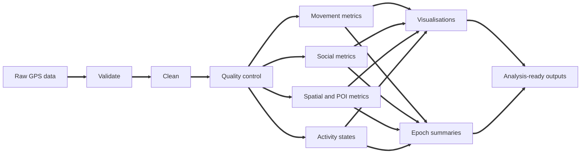

# grazer ecosystem roadmap

This document sketches the possible shape of the `grazer` ecosystem for collaborators. The aim is to build a coherent, reusable set of tools for precision livestock research in extensive grazing systems, starting with GPS workflows and expanding into other sensor streams and analysis modules.

The long-term ambition is that this becomes a go-to R ecosystem for researchers working with livestock sensor data, built around a small, deliberate object system, consistent naming, interoperable workflows, and practical modules for common research questions.

## Phase 1: GPS-focused CRAN package

Phase 1 will focus on getting `grazer` onto CRAN as a strong GPS workflow package.

The first release, as a minimum, should cover:

- GPS data validation and schema checks.
- Cleaning and quality control.
- Movement metrics.
- Basic social/proximity metrics.
- Spatial summaries.
- Distance to points of interest such as water, shade, supplements, fences, or infrastructure.
- Home-range and spatial-use summaries.
- Activity-state classification from GPS movement features.
- Epoch Summaries
- Visualisation and map-based exploration.
- A compact example dataset and vignettes that show a complete workflow.

This gives the project a clear first identity: `grazer` is the practical package for GPS-based livestock grazing workflows.

## Ecosystem vision

The broader ecosystem should be organised around research workflows, not only sensor hardware. Sensors are the inputs, but researchers usually care about questions such as:

- Where did animals spend time?
- How far did they move?
- How did they respond to boundaries, water, shade, pasture, heat, or management/feed/mineral?
- What behaviours were they performing?
- How reliable were the sensors?
- How can collar event streams and other animal-linked sensor streams be standardised?
- How can multiple sensor streams be combined into analysis-ready data?

```mermaid
mindmap
  root((grazer ecosystem))
    GPS
      cleaning
      movement
      proximity
      POI distance
      spatial interaction
      activity states
    Virtual fencing
      boundary events
      cue and pulse summaries
      learning curves
      compliance
      welfare checks
      sensor data standardisation
    Accelerometers
      handling noise
      applying common filter methods
      feature windows
      behaviour labels
      prediction models
      validation
      transfer across herds
    Remote sensing
      indices in raster and patch configurations
      water and shade layers
      biomass proxies
      raster extraction
      exposure summaries
    Environmental context
      weather
      heat load
      terrain
      paddock metadata
    Auxiliary sensor streams
      time linked individual streams (boli, greenfeed, liveweight)
    Data fusion
      aligned timelines
      shared object system
      multi-sensor features
      analysis datasets
```

## Possible modules

| Area | What it covers | Example outputs |
|---|---|---|
| GPS core | Validation, cleaning, movement, proximity, POI distance, spatial interaction, activity states, epoch summaries, maps | Clean tracks, speed, distance, turning, paddock use, proximity metrics, activity-state summaries |
| Virtual fencing | Response to virtual boundaries and collar event streams, including standardisation of raw vendor outputs | Cue counts, pulse counts, boundary approaches, compliance, learning curves, welfare summaries |
| Accelerometers | Cleaning noisy signals, applying common filter methods, extracting windows, and building behaviour prediction workflows | Filtered signals, feature tables, behaviour labels, prediction outputs, validation summaries |
| Remote sensing | Linking animals to raster- and patch-based landscape products and management layers | Vegetation index exposure, biomass proxies, water/shade availability, patch-use summaries |
| Environmental context | Weather, heat load, terrain, and paddock metadata linked to animals or epochs | Heat exposure summaries, rainfall windows, terrain-linked movement summaries, paddock context tables |
| Auxiliary sensor streams | Animal-linked temporal streams in written/tabular formats such as bolus data, GreenFeed data, liveweight, or similar non-image, non-audio sensor outputs | Time-aligned methane, rumen temperature, intake, visit events, liveweight changes, derived temporal summaries |
| Sensor QC | Data quality across devices and deployments | Missing fixes, irregular intervals, dropout diagnostics, stream completeness summaries |
| Multi-sensor fusion | Joining GPS, virtual fence, accelerometer, auxiliary sensor, environment, and remote-sensing products | Aligned timelines, modelling tables, reproducible analysis datasets, fused feature sets |

## What to include or omit as features

One of design decisions is not what to build, but what not to build.

The package should add value where livestock workflows are genuinely awkward, repetitive, or hard to standardise. It should avoid recreating tools that are already well solved elsewhere in the R ecosystem.

Principles:

- If a strong, widely used package already solves a problem cleanly, use it rather than wrapping it unnecessarily.
- Add grazer-specific functions where domain knowledge, repeated workflow pain points, or standardisation needs justify them.
- Prefer outputs that remain easy for users to inspect, modify, and extend in their own analyses.

Examples of what this means in practice:

- Spatial data should use `sf` directly. Grazer should work with `sf` objects, but it should not create a parallel spatial class or large wrapper layer around `sf`.
- Plotting should generally use `ggplot2` conventions. It is often better to point users back to `ggplot` rather than to create a large family of rigid plotting wrappers. If a visual is specialised enough to justify package support, it may be better implemented as a `geom_`, a helper that returns plotting data, or a function that returns a modifiable `ggplot` object.
- Data import functions should be kept minimal at this stage. `readr::read_csv()` and `data.table::fread()` are already sufficient in most cases. Instead of building ingest helpers, the start of the workflow should be a validation step that confirms the required fields, types, ordering, and metadata are present.

Tabular design principles:

- Return `data.frame` objects by default so outputs remain familiar and widely compatible.
- Use `data.table` internally where it provides clear speed and memory benefits for large livestock datasets.
- Keep the tabular backend fast, but keep the user-facing outputs simple.

This should help grazer stay focused on domain-specific workflow value rather than expanding into a general-purpose reimplementation of the wider R ecosystem.

## Shared object system

Returning information in R data frames reduces the barrier for researchers who already work in tidyverse, data.table, or base R workflows. The intent should be to keep the object system as small as possible. Where a good class already exists, it should be used directly rather than wrapped in a new grazer-specific class. In particular, spatial layers should use `sf` directly rather than introducing a separate spatial object.

Core object concepts:

- `grz_track`: row-level animal/sensor observations (gps, acc, methane, liveweight, etc.).
- `grz_epoch`: summarised data by time window.
- `grz_qc`: validation and sensor-quality summaries.
- `grz_model`: fitted classification or prediction objects (if built into grazer).

It's not clear at this stage how important it will be to define the `grz_epoch`, and `grz_qc` as standalone defined schemas; however, having a defined `grz_track` object should simplify data fusion modules in future.

Notes on object scope:
- Do not invent the wheel, if it's already simple in base R, or tidyverse, there is no need for additional schemas
- Spatial layers such as paddocks, POIs, fences, water, and shade should use `sf`.
- Auxiliary sensor streams such as bolus, GreenFeed, or liveweight should usually still fit within `grz_track`, with a clear schema for `sensor_type`, timestamps, animal linkage, and measured variables. However, there is a potential that movement and behaviour data are separated from other temporal sensor data.

## Package structure options

There are two ways the ecosystem could develop. At this stage, it's not clear what the best option it. And, there is potential that this changes as the function suite becomes more complex/sophisticated

### Option 1: One package to rule them all.

Everything stays inside `grazer`.

Advantages:

- Easier for users to install and learn at the start.
- One documentation site and one public package identity.
- Less coordination across packages and fewer dependency decisions for users.
- A simpler development path while the scope is still settling.

Risks:

- Heavy dependencies from remote sensing, modelling, accelerometer workflows, or specialised stream-processing tools could make installation and maintenance harder. Although, in theory, this can be tested by dev team.
- The package may become conceptually crowded as more specialist workflows are added.
- GPS, accelerometer, virtual fencing, remote sensing, weight, weather, and metadata streams may need distinct release cycles and different levels of maintenance attention.

### Option 2: Multiple smaller packages plus an aggregation package

If the workflows become sufficiently distinct, the ecosystem could move towards multiple smaller specialist packages with an aggregation package sitting above them.

In that model:

- stream-specific packages would handle specialist workflows such as GPS, accelerometers, virtual fencing, liveweight, or environmental data
- the aggregation package would not need to contain all workflow logic itself
- interoperability would occur mainly through standardised epoch summaries and analysis-ready tables

One possible shape could look like this:

```mermaid
flowchart LR
  A[Raw GPS data] ==> B[grazer.gps]
  C[Raw accelerometer data] ==> D[grazer.acc]
  E[Virtual fencing data] ==> F[grazer.vf]
  G[Weight data] ==> H[grazer.weight]
  I[Remote sensing and weather] ==> J[grazer.env]

  B ==> K[GPS epoch summaries]
  D ==> L[Behaviour epoch summaries]
  F ==> M[Virtual fencing epoch summaries]
  H ==> N[Weight epoch summaries]
  J ==> O[Environmental exposure summaries]

  K ==> P[grazer.fusion]
  L ==> P
  M ==> P
  N ==> P
  O ==> P

  P ==> Q[Analysis-ready outputs]
```

Preferred strategy:

Start with one practical package, `grazer`, focused on the GPS and movement workflow for extensively grazed livestock. Only move towards multiple smaller packages plus an aggregation package if there is a clear maintenance, dependency, or user-group reason to do so.

Maintain detailed documentation and vignettes can ensure the applications of the package are clear.

## Naming convention

The naming should be continuous and predictable across the ecosystem.

### Package names

- Use `grazer` for the CRAN GPS package.
- If the ecosystem later grows into multiple packages, keep the `grazer.*` family rather than introducing a second naming system.
- Do not rename the package family away from `grazer`.

### Function names

Keep the current `grz_` prefix.

Recommended naming pattern:

- Use `grz_<stream>_<verb>()` where the stream comes before the action.
- This makes related functions easier to discover through autocomplete. For example, typing `grz_vf_` should surface the virtual fencing workflow.
- Use shared verbs across streams where possible, such as `read`, `standardise`, `validate`, `clean`, `align`, `annotate`, `calculate`, `summarise`, `classify`, `tune`, and `plot`.

Example names across major workflows:

| Workflow | Example names |
|---|---|
| GPS | `grz_gps_read_csv()`, `grz_gps_standardise()`, `grz_gps_validate()`, `grz_gps_clean()`, `grz_gps_align()`, `grz_gps_calculate_movement()`, `grz_gps_summarise_epoch()`, `grz_gps_plot_map()` |
| Accelerometer | `grz_acc_read_csv()`, `grz_acc_standardise()`, `grz_acc_validate()`, `grz_acc_clean()`, `grz_acc_align()`, `grz_acc_calculate_features()`, `grz_acc_classify_behaviour()`, `grz_acc_plot_features()` |
| Virtual fencing | `grz_vf_read_events()`, `grz_vf_standardise()`, `grz_vf_validate()`, `grz_vf_clean()`, `grz_vf_align()`, `grz_vf_calculate_events()`, `grz_vf_summarise_epochs()`, `grz_vf_classify_response()`, `grz_vf_plot_events()` |

This naming convention results in long function names which might not be a preferred method. Alternatively, the `grz_` prefix could be dropped in favour of the `sensor_verb` naming style.

## Preferred direction

1. Get `grazer` onto CRAN as a polished GPS package.
2. Use phase 1 to establish the shared schema, naming style, and pipe-friendly workflow, with a view to expanding.
3. Treat virtual fencing, accelerometers, remote sensing, auxiliary sensor streams, and fusion as future modules.
4. Keep the package structure under review, and only move to multiple smaller packages if the ecosystem genuinely needs it.

# GPS phase 1 delivery plan

To achieve the CRAN goal, the GPS package should be treated as a scoped delivery project with clear task ownership. The most practical way to organise this is to start from what already exists in `grazer`, stabilise the function set, and then divide the remaining work into parallel streams.

The core idea is:

- define what the GPS package is responsible for in phase 1
- review the existing function set given the broader ecosystem and identify anything missing
- then split work into implementation and documentation, and testing and examples.

## Suggested order of work

1. Confirm the phase 1 function set from the current package.
2. Group those functions into a clear workflow for users.
3. Identify gaps, overlaps, and functions that are still experimental.
4. Assign tasks across function refinement & documentation; and, tests, and release preparation.
5. revise vignettes
6. Integrate, check, and prepare for CRAN submission.

## Proposed phase 1 function groups

The majority of these functions have some level of development in the current version of the package.

| Work area | Likely functions or outputs |
|---|---|
| Input and validation | `grz_validate()`, `grz_validate_gps()`, schema checks, canonical column expectations |
| Cleaning and QC | duplicate removal, error cleaning, speed filtering, denoising, fix-performance summaries |
| Alignment and preprocessing | alignment, downsampling, standard GPS preparation steps |
| Movement and proximity metrics | movement metrics, social/proximity summaries, POI distance summaries |
| Spatial summaries | spatial summaries, paddock annotation, home range, home-range change |
| Activity interpretation | activity-state classification, threshold tuning, validation, labelled workflows |
| Visualisation | maps, playback, summary plots?, diagnostic plots? |
| Example workflows | small package dataset, vignettes, end-to-end examples |

```mermaid
flowchart LR
  A[Raw GPS data] ==> B[Validate]
  B ==> C[Clean]
  C ==> D[Quality control]

  D ==> E[Movement metrics]
  D ==> F[Social metrics]
  D ==> G[Spatial and POI metrics]
  D ==> H[Activity states]

  E ==> I[Epoch summaries]
  F ==> I
  G ==> I
  H ==> I

  E ==> J[Visualisations]
  F ==> J
  G ==> J
  H ==> J

  J ==> K[Analysis-ready outputs]
  I ==> K
  
```

## Drill down into phase 1 functions

Review internal and external literature and documentation, the following have been proposed as a start point for a gps analysis workflow. The initial focus was to only calculate 1D outputs (speed, tortuosity, etc.), but the decision has been made to expand in some areas, returning polygons, networks, etc. These were considered "basic" requirements for gps analysis in gregarious grazing animals. The following functions have been proposed.

| Step | Function | One-line description |
|---|---|---|
| 1. Validation and pre-clean checks | `gps_validate()` | Check that GPS/GNSS data have the required columns, usable timestamps, valid coordinates, and animal or sensor IDs. |
|  | `gps_check_intervals()` | Summarise fix intervals, duplicated timestamps, missing fixes, and temporal gaps before cleaning. |
| | | |
| 2. Cleaning and quality-control functions | `gps_clean_duplicates()` | Flag or remove duplicate GPS/GNSS records. |
|  | `gps_clean_errors()` | Flag or remove obvious GPS/GNSS errors, such as invalid coordinates, invalid timestamps, or unusable records. |
|  | `gps_clean_speed_fixed()` | Remove implausible movements using a user-defined speed or step-distance threshold. |
|  | `gps_clean_speed_stat()` | Remove unusual movements using statistical thresholds based on the data. |
|  | `gps_clean_spatial()` | Remove records outside a nominated paddock, property, treatment area, or study boundary. |
|  | `gps_denoise()` | Remove short-lived GPS/GNSS noise, jumps, or track artefacts using an explicit denoising thresholds or statistical methods. |
|  | `gps_smooth()` | Fit splines to tracks and re-projeced points as required (only beneficial at high frequency sampling |
|  | `gps_qc_summary()` | Summarise data quality, missingness, retained records, removed records, and cleaning outcomes. |
| | | |
| 3. Movement functions | `gps_steps()` | Derive one row per movement step between consecutive GPS/GNSS fixes. |
|   | `gps_movement_metrics()` | Summarise step-level movement into distance, speed, displacement, straightness, and activity metrics. |
| | `gps_turning_metrics()` | Summarise turning angles and path shape from step-level data. |
|  | `gps_activity_proxy()` | Create simple GPS-derived activity classes or proportions from movement rules. |
| | | |
| 4. Social and proximity functions | `gps_proximity()` | Calculate pairwise distances between animals at matched or synchronised times. |
| | `gps_contacts()` | Detect contact or association events using distance and time rules. |
| | `gps_nearest_neighbour()` | Identify each animal’s closest neighbour at each time point or epoch. |
|  | `gps_neighbours_within_range()` | Count the number of animals within a user-defined distance threshold. |
| | | |
| 5. Epoch, animal, group, social, and network summaries | `gps_epoch_metrics()` | Summarise GPS/GNSS-derived outputs by repeated time periods such as hour, day, week, or deployment. |
| | `gps_animal_summary()` | Create one-row-per-animal summaries over a selected period. |
| | `gps_group_summary()` | Summarise outputs by herd, mob, paddock group, treatment, cohort, or other grouping. |
| | `gps_diurnal_metrics()` | Summarise movement or other GPS/GNSS metrics by hour of day or day-night period. |
| | `gps_social_summary()` | Summarise proximity, contact, nearest-neighbour, and neighbours-within-range outputs. |
| | `gps_network_summary()` | Convert contact or association summaries into network-ready tables or simple network summaries. |
| | | |
| 6. Spatial functions | `gps_mcp()` | Calculate minimum convex polygon space-use areas from GPS/GNSS points. |
|  | `gps_kde()` | Calculate kernel-density-based space-use outputs from GPS/GNSS points. |
|  | `gps_hotspots()` | Identify high-use areas from GPS/GNSS locations using grid or density approaches. |
| | | |
| 7. Resource-use functions | `gps_resource_distance()` | Calculate distance from GPS/GNSS records to resources or landscape features. |
|  | `gps_resource_use()` | Summarise time, fixes, or proportional use near resources or areas of interest. |
|  | `gps_resource_visits()` | Detect discrete visits to resources using distance, duration, and gap rules. |
| | | |
| 8. Sensitivity-analysis functions | `gps_sens_speed()` | Compare cleaning and movement outputs across alternative speed or distance thresholds. |
|  | `gps_sens_regularise()` | Compare outputs across alternative fix intervals, time grids, or interpolation rules. |
|  | `gps_sens_proximity()` | Compare social outputs across alternative proximity thresholds or synchronisation rules. |
|  | `gps_sens_resource()` | Compare resource-use outputs across alternative buffers, visit rules, or duration thresholds. |
|  | `gps_sens_space_use()` | Compare space-use outputs across alternative MCP, KDE, contour, grid, or minimum-fix settings. |
|  | `gps_compare_runs()` | Compare results from two or more cleaning, filtering, regularisation, or analysis runs. |
| | | |
| 9. Helper functions | `gps_regularise()` | Align GPS/GNSS records to a regular time grid using existing fixes where possible. |
|  | `gps_interpolate()` | Estimate GPS/GNSS locations at target times where observed fixes are missing. |
|  | `gps_downsample()` | Create lower-frequency versions of GPS/GNSS tracks for comparison or sensitivity testing. |
|  | `gps_gap_summary()` | Summarise missing records, long gaps, expected fixes, observed fixes, and completeness. |
|  | `gps_append_paddock_names()` | Assign paddock or area identifiers to GPS/GNSS fixes using a spatial overlay. |
|  | `gps_plot_gps()` | Plot GPS/GNSS points, cleaned records, removed records, and spatial overlays. |
|  | `gps_playback_gps()` | Create a time-ordered playback of GPS/GNSS locations for visual checking. |

## What is missing from the current `gps_` function set compared with the published literature?

# Summary of missing areas

The following summarises methods and analyses tha haven't been included in the core workflow, but may be beneficial to consider while developing frameworks and input/output schemas, or potentially should be pull into the core.

-High = next to deploy (if requied)

| Method or analysis family | Missing or underdeveloped in current `gps_` list | Suggested priority | Notes | Reference anchors |
|---|---|---:|---|---|
| Import and column standardisation | No function to map messy device exports into standard `gps_` column names. | High | Do we have a series of helper functions that convert smartpaddock, ceres, 701x, data into the expected data format? It's not a hard step to do this without the package, RR comment - its not hard but for a beginning user its a roadblock. Its also not hard for us to develop and include it. Only issue is that we will have to update as companies change. | |
| Deployment and animal-sensor metadata | No explicit handling of deployment periods, collar swaps, sensor-animal linkage, treatment groups, or valid study windows. RR comment - I think this is a high priority. I have a signficiant challenge with this issue and I think most researchers would. | High |  | |
| Device fix-quality filtering | No explicit function for HDOP, PDOP, satellites, fix type, fix validity, battery, or device-estimated error. | High |  | Agouridis et al. (2004); Ganskopp and Johnson (2007); Gupte et al. (2022) |
| Static-collar and known-point error checks | No method for evaluating positional error from stationary devices or known-location tests. | Medium |  | Agouridis et al. (2004); Ganskopp and Johnson (2007); Calabrese et al. (2016); Fleming and Calabrese (2023) | RR comment - some tags/collars make this hard because they go to sleep when stationary.
| Deployment artefact removal | No explicit function for records collected before fitting, after removal, during collar exchange, in a vehicle, or at a shed. | High |  | |
| Used/available data for resource selection | Resource-use summaries exist, but not model-ready RSF/SSF/iSSF datasets. | Medium | This is getting more into the datafusion side of `grazer` and should be parked until this point | Signer et al. (2019); `amt` documentation; Wade et al. (2025) |
| Revisitation and residence time | Resource visits exist, but not a general revisitation/residence-time framework. | Medium |  | Bracis et al. (2018); `recurse` documentation |
| Advanced dynamic interaction metrics | Proximity and contacts exist, but not formal dyadic interaction indices. | Low to medium |  | Long et al. (2014); `wildlifeDI` documentation; Fielding et al. (2021) |
| Behaviour-state modelling | HMM/GMM/model-ready behaviour outputs are used sparingly | Low for now | This moves into a much more involve level of analysis. It could be rolled out in this package, but feel it may be better suited to later deployment, or in fusion module  | Ungar et al. (2005); Williams et al. (2016); McClintock and Michelot (2018); `momentuHMM` documentation |
| Error-aware or autocorrelation-aware home range | MCP and KDE exist, but not AKDE, BBMM, dynamic BBMM, or LoCoH. | Low to medium | How important is it to be all encompassing of higher order spatial analyses? Does this meet the purpose of phase | Horne et al. (2007); Kranstauber et al. (2012); Calabrese et al. (2016); Fleming and Calabrese (2023) |
| Space-use overlap and change, and site fidelity | No explicit comparison of space-use polygons, utilisation distributions, or repeated use across time. | High | Should be considered  | Signer et al. (2019); `amt` documentation; Vidal-Cardos et al. (2025) |
| Model-ready design matrices | No general helper for turning GPS outputs into model-ready tables for mixed models, GAMs, RSFs, SSFs, or HMMs. | Medium | The goal is to help people get to modelling. Should we provide helpers to export model ready tables here? or later with data fusion?  |  |
| Formal reports | `gps_qc_summary()` is the only report | Medium | I hate reports. They never do exactly what I want and never will in their generic nature. I prefer robust tutorials.  | |
RR comment - might have missed this above - a standard map output would be useful. Heat map or similar, faceted by day, week, month, etc.
RR comment - some kind of standardized table of "deployment stats and QC" that could become the standard documentation to include in publications. It could become that reviewers come to excpect to the see this standard table in all pubs.
