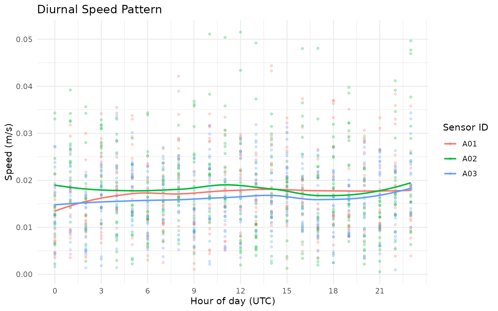

# GPS 101: Core Workflow

## Overview

This tutorial walks through the main `grazer` workflow for cattle GPS
data:

1.  Start from GPS rows in canonical columns (`sensor_id`, `datetime`,
    `lon`, `lat`).
2.  Validate required schema and data types.
3.  Clean obvious errors and noise.
4.  Calculate movement, social, and spatial metrics.
5.  Summarise results to daily metrics for interpretation.

## Why This Workflow?

A structured pipeline improves reproducibility and interpretation:

- You detect data issues before model fitting.
- You apply cleaning rules consistently across experiments.
- You generate comparable metrics across paddocks, cohorts, and
  deployments.
- You keep row-level and day-level outputs aligned for QA and reporting.

## 1) Load packages

``` r
library(grazer)
library(dplyr)
#> 
#> Attaching package: 'dplyr'
#> The following objects are masked from 'package:stats':
#> 
#>     filter, lag
#> The following objects are masked from 'package:base':
#> 
#>     intersect, setdiff, setequal, union
library(tidyr)
library(tibble)
library(ggplot2)
```

## 2) Create an example GPS table

This vignette uses synthetic data so it is fully reproducible.  
In real projects, start by reading your file, mapping to the required
schema, then validating:

``` r
gps_raw <- readr::read_csv("your_file.csv", show_col_types = FALSE)

# Required canonical columns for grazer:
# sensor_id, datetime, lon, lat
gps <- dplyr::rename(
  gps_raw,
  sensor_id = device_id,
  datetime = Time,
  lon = Longitude,
  lat = Latitude
)

gps <- grz_validate(gps, drop_invalid = FALSE, verbose = TRUE)
```

How this works in practice:

- Keep raw ingest as close as possible to source files.
- Add only minimal transformations before validation.
- Preserve metadata columns so they can be used later in grouping and
  summaries.

Common pitfalls and checks:

- Pitfall: parsing datetimes in local time by accident.  
  Check: confirm all times are parsed in the same timezone (typically
  UTC).
- Pitfall: silently coercing text coordinates to `NA`.  
  Check: inspect rows with missing/invalid `lon`/`lat` before cleaning.

``` r
set.seed(101)

timestamps <- seq(
  from = as.POSIXct("2024-05-01 00:00:00", tz = "UTC"),
  by = "10 min",
  length.out = 3 * 24 * 6
)

animal_info <- tibble(
  sensor_id = c("A01", "A02", "A03"),
  lon0 = c(132.305, 132.299, 132.311),
  lat0 = c(-14.474, -14.471, -14.468)
)

gps_list <- list()
for (i in seq_len(nrow(animal_info))) {
  gps_list[[i]] <- tibble(
    sensor_id = animal_info$sensor_id[i],
    datetime = timestamps,
    lon = animal_info$lon0[i] + cumsum(rnorm(length(timestamps), 0, 0.00018)),
    lat = animal_info$lat0[i] + cumsum(rnorm(length(timestamps), 0, 0.00015))
  )
}
gps_raw <- bind_rows(gps_list)

# Add a few realistic issues so validation and cleaning have visible effects.
gps_raw <- bind_rows(gps_raw, gps_raw %>% slice(1:5)) # duplicate rows
gps_raw$lon[20] <- 0                                  # invalid location (0,0)
gps_raw$lat[20] <- 0
gps_raw$datetime[33] <- NA                            # invalid datetime

nrow(gps_raw)
#> [1] 1301
head(gps_raw)
#> # A tibble: 6 × 4
#>   sensor_id datetime              lon   lat
#>   <chr>     <dttm>              <dbl> <dbl>
#> 1 A01       2024-05-01 00:00:00  132. -14.5
#> 2 A01       2024-05-01 00:10:00  132. -14.5
#> 3 A01       2024-05-01 00:20:00  132. -14.5
#> 4 A01       2024-05-01 00:30:00  132. -14.5
#> 5 A01       2024-05-01 00:40:00  132. -14.5
#> 6 A01       2024-05-01 00:50:00  132. -14.5
```

## 3) Validate required columns and row values

``` r
gps_valid <- grz_validate(
  data = gps_raw,
  drop_invalid = FALSE,
  verbose = TRUE
)
#> [validate] rows=1,301 invalid=1 drop_invalid=FALSE

validation_qc <- attr(gps_valid, "validation_qc")
invalid_rows <- attr(gps_valid, "invalid_rows")

validation_qc
#>                 metric count   proportion
#>                 <char> <int>        <num>
#> 1:              n_rows  1301 1.0000000000
#> 2:      n_invalid_rows     1 0.0007686395
#> 3: n_missing_sensor_id     0 0.0000000000
#> 4:  n_invalid_datetime     1 0.0007686395
#> 5:       n_invalid_lon     0 0.0000000000
#> 6:       n_invalid_lat     0 0.0000000000
head(invalid_rows)
#>    sensor_id datetime      lon       lat   invalid_reason
#>       <char>   <POSc>    <num>     <num>           <char>
#> 1:       A01     <NA> 132.3049 -14.47494 invalid_datetime
```

The validation object provides:

- `validation_qc`: counts/proportions of invalid records by issue type.
- `invalid_rows`: full rows that failed validation checks, with
  `invalid_reason`.

How this works in practice:

- [`grz_validate()`](https://wobblytwilliams.github.io/grazer/reference/grz_validate.md)
  enforces the minimum schema (`sensor_id`, `datetime`, `lon`, `lat`).
- It parses and type-checks each core field.
- It records invalid reasons at row level so decisions are auditable.

Common pitfalls and checks:

- Pitfall: dropping invalid rows too early can hide data-logger
  issues.  
  Check: run once with `drop_invalid = FALSE` and inspect
  `invalid_rows`.
- Pitfall: blank `sensor_id` values across multiple animals.  
  Check: verify `sensor_id` uniqueness and completeness before movement
  metrics.

## 4) Clean the GPS rows

This run applies four common cleaning steps:

- `duplicates`: removes repeated fixes.
- `errors`: drops invalid coordinates and malformed rows.
- `speed_fixed`: removes biologically implausible moves.
- `denoise`: reduces local GPS bounce in static periods.

``` r
gps_clean <- grz_clean(
  data = gps_valid,
  steps = c("duplicates", "errors", "speed_fixed", "denoise"),
  max_speed_mps = 4,
  verbose = TRUE
)
#> [clean] start_rows=1,301
#> [clean_duplicates] dropped: 5 | rows: 1,301 -> 1,296
#> [clean_errors] dropped_sensor=0 dropped_datetime=1 dropped_coord=0 dropped_zero_zero=1
#> [clean_errors] dropped: 2 | rows: 1,296 -> 1,294
#> [clean_speed_fixed] threshold=4.000 m/s
#> [clean_speed_fixed] dropped: 0 | rows: 1,294 -> 1,294
#> [denoise] method=statistical
#> [denoise] dropped: 0 | rows: 1,294 -> 1,294
#> [clean] final_rows=1,294

nrow(gps_clean)
#> [1] 1294
head(gps_clean)
#>   sensor_id            datetime      lon       lat  lon_raw   lat_raw
#> 1       A01 2024-05-01 00:00:00 132.3050 -14.47393 132.3049 -14.47395
#> 2       A01 2024-05-01 00:10:00 132.3050 -14.47390 132.3050 -14.47391
#> 3       A01 2024-05-01 00:20:00 132.3050 -14.47387 132.3049 -14.47379
#> 4       A01 2024-05-01 00:30:00 132.3050 -14.47385 132.3050 -14.47394
#> 5       A01 2024-05-01 00:40:00 132.3051 -14.47382 132.3050 -14.47372
#> 6       A01 2024-05-01 00:50:00 132.3052 -14.47379 132.3052 -14.47383
```

How this works in practice:

- Cleaning is intentionally drop-based and ordered.
- Duplicate and invalid coordinate fixes are removed first.
- Speed filtering removes biologically implausible jumps.
- Denoising removes jitter during likely static periods.

Common pitfalls and checks:

- Pitfall: speed threshold too strict for your production class (e.g.,
  mustering).  
  Check: inspect upper speed tail before setting `max_speed_mps`.
- Pitfall: aggressive denoising in coarse sampling intervals.  
  Check: compare pre/post row counts by animal and day.

## 5) Calculate movement metrics (row-level)

``` r
gps_movement <- grz_calculate_movement(gps_clean, verbose = FALSE)

movement_view <- gps_movement %>%
  as_tibble() %>%
  select(sensor_id, datetime, step_m, speed_mps, turn_rad)

movement_view
#> # A tibble: 1,294 × 5
#>    sensor_id datetime            step_m speed_mps turn_rad
#>    <chr>     <dttm>               <dbl>     <dbl>    <dbl>
#>  1 A01       2024-05-01 00:00:00  NA     NA        NA     
#>  2 A01       2024-05-01 00:10:00   4.31   0.00718  NA     
#>  3 A01       2024-05-01 00:20:00   2.80   0.00466   0.166 
#>  4 A01       2024-05-01 00:30:00   4.18   0.00697   0.739 
#>  5 A01       2024-05-01 00:40:00   8.44   0.0141    0.253 
#>  6 A01       2024-05-01 00:50:00  11.3    0.0189    0.0933
#>  7 A01       2024-05-01 01:00:00  12.0    0.0200    0.0903
#>  8 A01       2024-05-01 01:10:00  10.5    0.0174    0.147 
#>  9 A01       2024-05-01 01:20:00   7.59   0.0127    0.281 
#> 10 A01       2024-05-01 01:30:00   5.00   0.00834   0.272 
#> # ℹ 1,284 more rows

movement_more <- setdiff(names(gps_movement), names(movement_view))
cat(
  "i",
  length(movement_more),
  "more columns:",
  paste(head(movement_more, 10), collapse = ", "),
  if (length(movement_more) > 10) ", ..." else "",
  "\n"
)
#> i 8 more columns: lon, lat, lon_raw, lat_raw, step_dt_s, bearing_deg, cum_distance_m, net_displacement_m
```

Key movement variables:

- `step_m`: great-circle distance between consecutive fixes.
- `speed_mps`: step distance divided by elapsed time in seconds.
- `turn_rad`: absolute turning angle (radians) between consecutive
  bearings.

How this works in practice:

- `step_m` is great-circle distance between consecutive fixes.
- `speed_mps` is `step_m / step_dt_s`.
- `turn_rad` uses the absolute difference in successive headings.

Common pitfalls and checks:

- Pitfall: irregular fix intervals inflate/deflate apparent speed.  
  Check: inspect `step_dt_s` distribution.
- Pitfall: first fix per track has no lag values.  
  Check: expect `NA` in first row of each group for lag-derived metrics.

``` r
gps_movement %>%
  as_tibble() %>%
  ggplot(aes(x = step_m, fill = sensor_id)) +
  geom_histogram(bins = 40, alpha = 0.55, position = "identity") +
  labs(
    title = "Step Distance Distribution",
    x = "Step distance (m)",
    y = "Count",
    fill = "Sensor ID"
  ) +
  theme_minimal()
#> Warning: Removed 3 rows containing non-finite outside the scale range
#> (`stat_bin()`).
```


``` r
gps_movement %>%
  as_tibble() %>%
  mutate(hour = as.integer(format(datetime, "%H", tz = "UTC"))) %>%
  ggplot(aes(x = hour, y = speed_mps, color = sensor_id)) +
  geom_point(alpha = 0.25, size = 1) +
  geom_smooth(se = FALSE, linewidth = 0.8) +
  scale_x_continuous(breaks = seq(0, 23, by = 3)) +
  labs(
    title = "Diurnal Speed Pattern",
    x = "Hour of day (UTC)",
    y = "Speed (m/s)",
    color = "Sensor ID"
  ) +
  theme_minimal()
#> `geom_smooth()` using method = 'loess' and formula = 'y ~ x'
#> Warning: Removed 3 rows containing non-finite outside the scale range
#> (`stat_smooth()`).
#> Warning: Removed 3 rows containing missing values or values outside the scale range
#> (`geom_point()`).
```



## 6) Calculate social metrics (row-level)

``` r
gps_social <- grz_calculate_social(
  gps_movement,
  thresholds_m = c(30, 50, 100),
  interpolate = FALSE,
  verbose = FALSE
)

n30_col <- grep("^n_within_\\s*30m$", names(gps_social), value = TRUE)
if (length(n30_col) == 0L) {
  stop("Expected a 30 m neighbour count column after grz_calculate_social().")
}

gps_social_tbl <- gps_social %>%
  as_tibble() %>%
  mutate(n_within_30m = .data[[n30_col[[1]]]])

social_view <- gps_social_tbl %>%
  select(sensor_id, datetime, nearest_neighbor_m, n_within_30m, mean_dist_to_others_m)

social_view
#> # A tibble: 1,294 × 5
#>    sensor_id datetime            nearest_neighbor_m n_within_30m
#>    <chr>     <dttm>                           <dbl>        <int>
#>  1 A01       2024-05-01 00:00:00               709.            0
#>  2 A01       2024-05-01 00:10:00               710.            0
#>  3 A01       2024-05-01 00:20:00               708.            0
#>  4 A01       2024-05-01 00:30:00               703.            0
#>  5 A01       2024-05-01 00:40:00               694.            0
#>  6 A01       2024-05-01 00:50:00               684.            0
#>  7 A01       2024-05-01 01:00:00               677.            0
#>  8 A01       2024-05-01 01:10:00               677.            0
#>  9 A01       2024-05-01 01:20:00               684.            0
#> 10 A01       2024-05-01 01:30:00               698.            0
#> # ℹ 1,284 more rows
#> # ℹ 1 more variable: mean_dist_to_others_m <dbl>

social_more <- setdiff(names(gps_social), names(social_view))
cat(
  "i",
  length(social_more),
  "more columns:",
  paste(head(social_more, 10), collapse = ", "),
  if (length(social_more) > 10) ", ..." else "",
  "\n"
)
#> i 17 more columns: lon, lat, lon_raw, lat_raw, step_dt_s, step_m, speed_mps, bearing_deg, turn_rad, cum_distance_m , ...
```

Key social variables:

- `nearest_neighbor_m`: distance to closest other animal at matching
  timestamp.
- `n_within_30m`: number of other animals within 30 m.
- `mean_dist_to_others_m`: average distance to all other animals.

How this works in practice:

- For each timestamp (and optional herd partition), pairwise distances
  are computed.
- Nearest-neighbour metrics and threshold counts are derived from the
  distance matrix.
- Threshold columns (`n_within_*m`, `any_within_*m`) support
  density/proximity interpretation.

Common pitfalls and checks:

- Pitfall: unsynchronised timestamps between collars.  
  Check: use
  [`grz_align()`](https://wobblytwilliams.github.io/grazer/reference/grz_align.md)
  when needed before social metrics.
- Pitfall: interpreting social isolation in very small group sizes.  
  Check: inspect `social_group_size` before interpretation.

``` r
gps_social_tbl %>%
  ggplot(aes(x = nearest_neighbor_m, fill = sensor_id)) +
  geom_density(alpha = 0.35) +
  labs(
    title = "Nearest-Neighbour Distance Density",
    x = "Nearest neighbour distance (m)",
    y = "Density",
    fill = "Sensor ID"
  ) +
  theme_minimal()
```


``` r
gps_social_tbl %>%
  mutate(day = as.Date(datetime)) %>%
  group_by(sensor_id, day) %>%
  summarise(mean_n_within_30m = mean(n_within_30m, na.rm = TRUE), .groups = "drop") %>%
  ggplot(aes(x = day, y = mean_n_within_30m, color = sensor_id)) +
  geom_line(linewidth = 0.9) +
  geom_point(size = 1.8) +
  labs(
    title = "Daily Mean Number of Animals Within 30 m",
    x = "Day",
    y = "Mean n_within_30m",
    color = "Sensor ID"
  ) +
  theme_minimal()
```


## 7) Summarise to day-level movement, social, and spatial outputs

``` r
daily_metrics <- grz_calculate_epoch_metrics(
  data = gps_social,
  epoch = "day",
  include = c("movement", "social", "spatial"),
  verbose = FALSE
)

summary_view <- daily_metrics %>%
  as_tibble() %>%
  select(sensor_id, epoch, total_distance_m, mean_nn_m, mcp95_area_ha)

summary_view
#> # A tibble: 9 × 5
#>   sensor_id epoch      total_distance_m mean_nn_m mcp95_area_ha
#>   <chr>     <chr>                 <dbl>     <dbl>         <dbl>
#> 1 A01       2024-05-01            1611.      751.          3.89
#> 2 A01       2024-05-02            1358.      850.          4.39
#> 3 A01       2024-05-03            1487.      718.          3.66
#> 4 A02       2024-05-01            1469.      759.          5.04
#> 5 A02       2024-05-02            1637.      781.          6.97
#> 6 A02       2024-05-03            1523.      718.          3.54
#> 7 A03       2024-05-01            1358.     1018.          4.78
#> 8 A03       2024-05-02            1513.      964.          5.43
#> 9 A03       2024-05-03            1277.     1653.          6.73

summary_more <- setdiff(names(daily_metrics), names(summary_view))
cat(
  "i",
  length(summary_more),
  "more columns:",
  paste(head(summary_more, 10), collapse = ", "),
  if (length(summary_more) > 10) ", ..." else "",
  "\n"
)
#> i 21 more columns: n_fixes, mean_step_m, median_step_m, p95_step_m, mean_speed_mps, p95_speed_mps, max_speed_mps, mean_abs_turn_rad, social_n_fixes, p50_nn_m , ...
```

Key summary variables:

- `total_distance_m`: total distance moved over the epoch.
- `mean_nn_m`: mean nearest-neighbour distance over the epoch.
- `mcp95_area_ha`: 95% minimum convex polygon home-range area (ha).

How this works in practice:

- Epoch summaries aggregate row-level metrics to `day`, `week`, or
  `month`.
- Movement, social, and spatial blocks are merged on shared keys.
- Spatial area metrics are only meaningful with adequate fixes per
  epoch.

Common pitfalls and checks:

- Pitfall: over-interpreting area estimates from sparse days.  
  Check: screen by `n_fixes` before comparing `mcp95_area_ha`.
- Pitfall: combining epochs with different grazing contexts.  
  Check: facet/stratify by paddock, cohort, or treatment when available.

``` r
daily_metrics %>%
  as_tibble() %>%
  mutate(epoch = as.Date(epoch)) %>%
  ggplot(aes(x = epoch, y = total_distance_m, color = sensor_id, group = sensor_id)) +
  geom_line(linewidth = 0.9) +
  geom_point(size = 2) +
  labs(
    title = "Daily Total Distance by Animal",
    x = "Day",
    y = "Total distance (m)",
    color = "Sensor ID"
  ) +
  theme_minimal()
```


``` r
daily_metrics %>%
  as_tibble() %>%
  mutate(epoch = as.Date(epoch)) %>%
  ggplot(aes(x = epoch, y = mcp95_area_ha, color = sensor_id, group = sensor_id)) +
  geom_line(linewidth = 0.9) +
  geom_point(size = 2) +
  labs(
    title = "Daily 95% MCP Area by Animal",
    x = "Day",
    y = "MCP95 area (ha)",
    color = "Sensor ID"
  ) +
  theme_minimal()
```


## 8) Diurnal feature plots

[`grz_plot_diurnal_metrics()`](https://wobblytwilliams.github.io/grazer/reference/grz_plot_diurnal_metrics.md)
gives an interpretable view of how movement features vary by
hour-of-day.

How this works in practice:

- Hour-of-day aggregation is applied per metric and group.
- Heatmaps highlight temporal structure that is useful for threshold
  setting.

Common pitfalls and checks:

- Pitfall: timezone mismatch between sensor logging and ecological
  interpretation.  
  Check: set and verify timezone assumptions before diurnal plotting.

``` r
grz_plot_diurnal_metrics(
  data = gps_social,
  metrics = c("step_m", "turn_rad"),
  group_col = "sensor_id",
  agg_fun = "median",
  scale = "none"
)
```


## Next Step

Continue to the 201 tutorial for:

- active/inactive classification,
- manual state labelling with
  [`grz_label_gps_states()`](https://wobblytwilliams.github.io/grazer/reference/grz_label_gps_states.md),
- and prediction-vs-label validation.

## References

- Sinnott, R. W. (1984). *Virtues of the Haversine*. Sky and Telescope,
  68(2), 159.  
  Distance calculations in `grazer` use the great-circle (haversine)
  approach.
- Burt, W. H. (1943). *Territoriality and home range concepts as applied
  to mammals*.  
  Journal of Mammalogy, 24(3), 346-352.  
  Conceptual basis for home-range summaries such as MCP.
